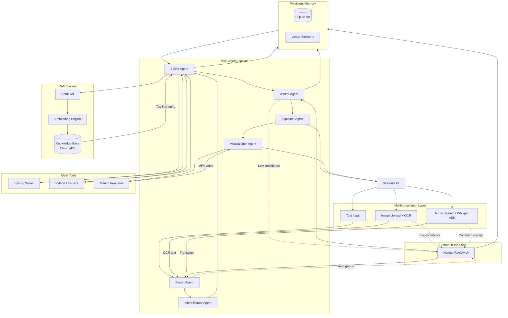

# Multimodal Math Mentor — Architecture

## System Overview

Multimodal Math Mentor is an AI-powered tutoring system that accepts JEE-style math
problems via **image**, **audio**, or **text**, and returns verified, step-by-step
solutions using a multi-agent architecture with RAG, HITL, and persistent memory.

---

## Architecture Diagram (Mermaid)



---

## Data Flow

1. **Input** → User provides question via text, image, or audio.
2. **Preprocessing** → OCR (PaddleOCR/EasyOCR) / ASR converts to text.  Low-confidence triggers HITL.
3. **Parsing** → Parser Agent structures the problem (topic, variables, constraints).
4. **Routing** → Intent Router classifies domain and selects workflow.
5. **Solving** → Solver Agent retrieves RAG context, uses SymPy/Python, computes answer.
6. **Verification** → Verifier Agent checks correctness, edge cases, constraints.
7. **Explanation** → Explainer Agent generates beginner-friendly step-by-step solution.
8. **Visualization** → Visualization Agent generates Manim animation of the solution.
9. **Memory** → Problem, solution, feedback stored for future retrieval and learning.
10. **HITL** → Humans can edit, correct, or reject at any stage.

---

## Component Details

| Component | Technology |
|---|---|
| UI | Streamlit |
| LLM | OpenAI GPT-4o / Claude / Groq (configurable) |
| OCR | PaddleOCR (preferred) / EasyOCR (fallback) |
| ASR | OpenAI Whisper |
| Vector DB | ChromaDB |
| Embeddings | sentence-transformers (`all-MiniLM-L6-v2`) |
| Math Tools | SymPy, Python `eval` (sandboxed) |
| Visualization | Manim (Community Edition) |
| Database | SQLite |
| Agents | LangChain-style agents (custom implementation) |
| Deployment | Streamlit Cloud / HuggingFace Spaces / Docker |

---

## Agent Responsibilities

| Agent | Role |
|---|---|
| **Parser** | Cleans raw text, extracts structured problem, detects ambiguity |
| **Intent Router** | Classifies topic (algebra, calculus, probability, linear algebra) |
| **Solver** | Retrieves RAG context, applies math tools, produces answer |
| **Verifier** | Validates answer for correctness, domain constraints, edge cases |
| **Explainer** | Generates step-by-step beginner-friendly explanation |
| **Visualization** | Generates Manim animation script and renders MP4 video |

---

## HITL Trigger Conditions

- OCR confidence < threshold (default 0.7)
- Parser detects ambiguity (`needs_clarification = true`)
- Verifier confidence < threshold (default 0.75)
- User presses "Re-check" button

---

## Memory Schema

```
solved_problems:
  id, timestamp, input_type, raw_input, parsed_problem,
  topic, retrieved_context, solution, explanation,
  verifier_confidence, user_feedback, corrections
```

Vector embeddings stored alongside for similarity-based retrieval.
